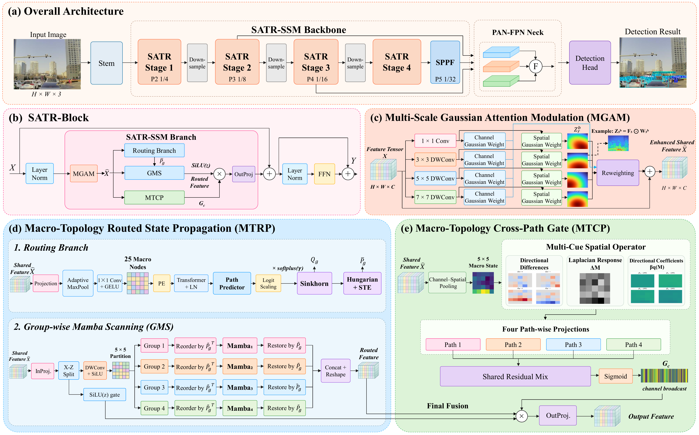
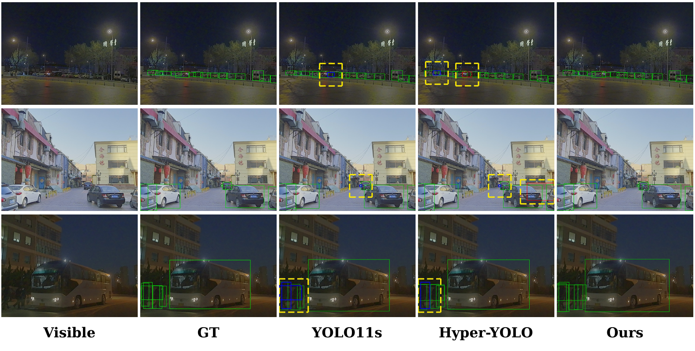
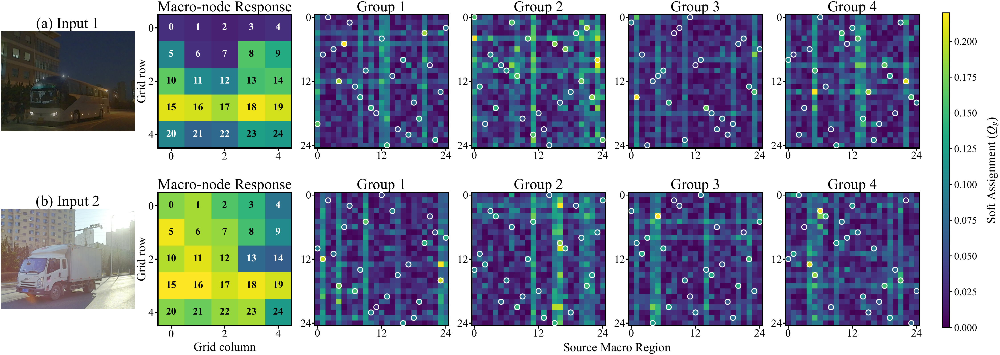
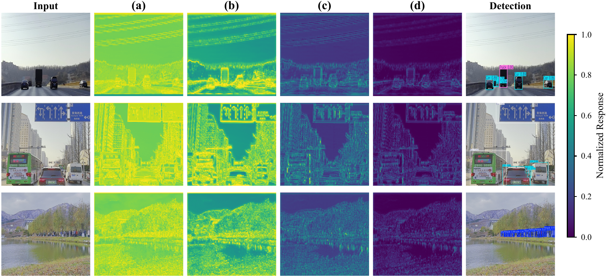

# SATR-SSM: Saliency-Aware Topology-Routed State Space Modeling for Object Detection

*[Liuyuze Huang](mailto:huanglyuze@163.com)<sup>a</sup>, [Weijia Chen](mailto:weijiachen1192@163.com)<sup>b</sup>, [Jiaming Liu](mailto:2402148@stu.neu.edu.cn)<sup>c</sup>, [Zirui Fang](mailto:fangzirui@mails.neu.edu.cn)<sup>d</sup>, [Zikang Yan](mailto:zikangyan2026@163.com)<sup>d</sup>, [Yaoming Zhuang](mailto:zhuangyaoming@mail.neu.edu.cn)<sup>c,*</sup>*

<sup>a</sup> School of Computer Science and Engineering, Northeastern University, Shenyang 110819, China  
<sup>b</sup> School of Mechanical Engineering and Automation, Northeastern University, Shenyang 110819, China  
<sup>c</sup> Faculty of Robot Science and Engineering, Northeastern University, Shenyang 110819, China  
<sup>d</sup> College of Information Science and Engineering, Northeastern University, Shenyang 110819, China  
<sup>*</sup> Corresponding author: [Yaoming Zhuang](mailto:zhuangyaoming@mail.neu.edu.cn)

Liuyuze Huang and Weijia Chen contributed equally to this work.

This is the official repository of **SATR-SSM: Saliency-Aware Topology-Routed State Space Modeling for Object Detection**. This document summarizes the method, environment requirements, repository layout, dataset preparation, pretrained weights, and commands for training and evaluation.

> This release contains the paper, figures, and M3FD pretrained weights. The source code will be made publicly available upon acceptance of the paper. The commands below document the implementation and require the future code release; this release is not a runnable package.

[](https://www.python.org/)
[](https://pytorch.org/)
[](LICENSE)

**[Paper (PDF)](paper/SATR_SSM_ICASSP2027.pdf)** · **[M3FD pretrained weights](weights/M3FDbest.pt)**

## Performance at a Glance

| Dataset | Precision | Recall | mAP50 | mAP50:95 | Params (M) |
|---|---:|---:|---:|---:|---:|
| M3FD | 0.819 | 0.626 | **0.706** | 0.435 | 3.72 |
| MFAD | 0.783 | 0.578 | 0.655 | **0.422** | 3.72 |

## Architecture



*Architecture and module flow of SATR-SSM. MGAM enhances multi-scale saliency, MTRP learns group-specific macro-region permutations while retaining all spatial positions, and MTCP calibrates the restored multi-path outputs using shared macro structure.*

SATR-SSM uses a two-layer convolutional stem, four hierarchical SATR stages, and an SPPF module. A PAN-FPN fuses P3, P4, and P5 features before the detection head. The backbone and complete detector contain 2.50M and 3.72M parameters, respectively.

## Requirements

The implementation uses the following environment; installation files will accompany the code release.

- Linux x86_64 and Python 3.12.3
- PyTorch 2.4.1+cu121 and torchvision 0.19.1+cu121
- Mamba 2.2.2, causal-conv1d 1.4.0, and timm 0.4.12
- Modified Ultralytics 8.3.240
- CUDA-compatible GPU; the paper uses one NVIDIA GeForce RTX 2080 Ti (11 GB)

Create a clean environment after the code is released:

```bash
conda create -n satr-ssm python=3.12.3 pip -y
conda activate satr-ssm
python -m pip install -r requirements.txt
```

## Repository Layout

```text
SATR-SSM/
├── figures/
│   ├── architecture.png              # Overall architecture (Fig. 1)
│   ├── routing.png                   # Group-specific routing (Fig. 2)
│   ├── heatmap.png                   # Stage-wise responses (Fig. 3)
│   └── detection.png                 # Detection visualization (Fig. 4)
├── paper/
│   └── SATR_SSM_ICASSP2027.pdf        # Manuscript
├── weights/
│   └── M3FDbest.pt                   # M3FD pretrained checkpoint
├── LICENSE
└── README.md
```

## Dataset Preparation

The paper evaluates visible-light images from M3FD and MFAD at 640×640 resolution. Keep datasets outside the repository. Use YOLO detection annotations with matching image and label stems and preserve the original training/evaluation splits and class order.

```text
DATASET_ROOT/
├── images/
│   ├── train/
│   └── val/
└── labels/
    ├── train/
    └── val/
```

Each label file contains one object per line:

```text
class_id x_center y_center width height
```

Coordinates must be normalized to `[0, 1]`. Dataset YAML files and split lists are not included in this release.

### M3FD

See the dataset paper: [Target-Aware Dual Adversarial Learning and a Multi-Scenario Multi-Modality Benchmark To Fuse Infrared and Visible for Object Detection](https://openaccess.thecvf.com/content/CVPR2022/html/Liu_Target-Aware_Dual_Adversarial_Learning_and_a_Multi-Scenario_Multi-Modality_Benchmark_To_CVPR_2022_paper.html), CVPR 2022.

### MFAD

See the dataset paper: [EI²Det: Edge-Guided Illumination-Aware Interactive Learning for Visible-Infrared Object Detection](https://doi.org/10.1109/TCSVT.2025.3539625), IEEE TCSVT, 2025.

## Pretrained Weight

| Dataset | Checkpoint | mAP50 | mAP50:95 |
|---|---|---:|---:|
| M3FD | [weights/M3FDbest.pt](weights/M3FDbest.pt) | 0.706 | 0.435 |
| MFAD | Not released | 0.655 | 0.422 |

The M3FD checkpoint is the existing released `best.pt`, renamed without changing its contents (7,827,765 bytes).

SHA256:

```text
953575c69f410ea54f005f0f53bc564a9593b4273c93aa2a95fa8a765a7adf38
```

The checkpoint requires the corresponding SATR-SSM modules to load. Those modules are not included in this paper-and-weights release. The MFAD row reports paper results only; no MFAD checkpoint is currently provided.

## Training

The existing M3FD training configuration uses 100 epochs, batch size 8, 640×640 images, AdamW with initial learning rate 0.0012, cosine scheduling, and no mixed-precision training. The paper uses a macro grid of `G=5` and MGAM `k=6`.

After the code release, set `DATA_YAML` in `train.py` to the dataset YAML's absolute path and run:

```bash
python train.py
```

## Evaluation

### M3FD

After the code release, evaluate with the original validation split:

```bash
python test.py --weights weights/M3FDbest.pt --data /absolute/path/to/m3fd.yaml --split val --device 0
```

### MFAD

The paper reports MFAD results in the tables above. Evaluation requires the MFAD checkpoint and code release, which are not included here.

## Inference

After the code release:

```bash
python predict.py --weights weights/M3FDbest.pt --source /path/to/visible/images --device 0
```



*Visible-light detections on M3FD. Columns show the visible image, ground truth, YOLO11s, Hyper-YOLO, and SATR-SSM.*

## Method

### Multi-Scale Gaussian Attention Modulation

MGAM enhances multi-scale channel and spatial saliency before routing. Residual aggregation combines Gaussian attention responses across convolutional scales and provides a shared feature for the router, feature projection, and MTCP.

### Macro-Topology Routed State Propagation

MTRP predicts a one-to-one macro-region permutation for each channel group using Sinkhorn normalization, Hungarian matching, and a straight-through estimator. It retains all intra-region positions, performs group-wise Mamba propagation, and restores the original spatial layout.



### Macro-Topology Cross-Path Gate

MTCP extracts shared pre-routing macro structure using directional transport and isotropic diffusion. Path-specific projections and shared residual mixing generate channel-wise gates to calibrate restored MTRP outputs.



## Citation

If this work is useful in your research, please cite the manuscript. Publication metadata will be updated after acceptance.

```bibtex
@misc{huang2026satrssm,
  title={SATR-SSM: Saliency-Aware Topology-Routed State Space Modeling for Object Detection},
  author={Huang, Liuyuze and Chen, Weijia and Liu, Jiaming and Fang, Zirui and Yan, Zikang and Zhuang, Yaoming},
  year={2026},
  note={Manuscript},
  url={https://github.com/TingFeng36/SATR-SSM}
}
```

## Funding

This research was supported in part by the National Natural Science Foundation of China (62403108, 42301256), the Key R&D Program of National Fire Rescue Bureau (2026XFZD05), the Fundamental Research Funds for the Central Universities (2026GFYD01, N25LPY056), and the Science and Technology Planning Project of Liaoning Province (2025JH2/101800350, 2024JH2/102400049, and 2023JH1/11200011).
